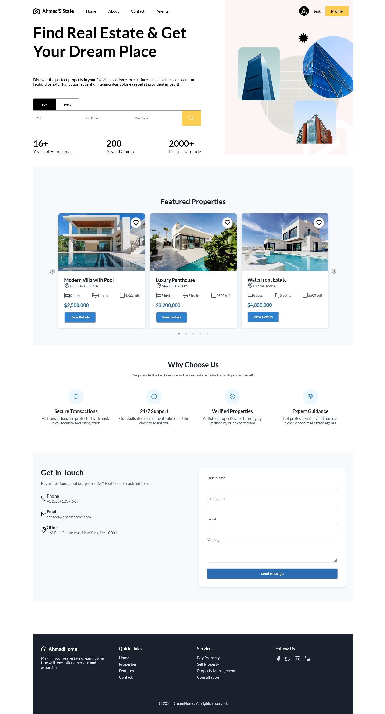

# Ahmad Real State

A modern real estate platform that allows users to search, buy, and rent properties, view detailed property information on an interactive map, and communicate directly with property owners and admins. The platform supports role-based access for different users (User, Admin, and SuperAdmin).




## Features

- **Role-Based System**: 
  - Secure login, registration, and roles for User, Admin, and SuperAdmin.
  - Role-based access control to ensure the right users have the appropriate permissions.
  
- **Location Search with Maps**:
  - Find properties by location and type (Rent/Buy) with an integrated map.
  - Users can filter and view properties on an interactive map.
  
- **Messaging Feature**:
  - Direct messaging between users (buyers/renters) and admins/sellers.
  - Built using React for the frontend, Node.js for the backend, Prisma for ORM, and MongoDB for data storage.
  
- **Responsive Design**: 
  - Mobile-friendly UI for seamless browsing on all devices.

## Tech Stack

- **Frontend**: React, Tailwind CSS
- **Backend**: Node.js, Express.js
- **Database**: MongoDB, Prisma ORM
- **Authentication**: JWT, bcrypt.js for password hashing
- **Map Integration**: Google Maps API or OpenStreetMap
  
## Installation

### Prerequisites

- Node.js (v14+)
- MongoDB (for local development) or a cloud MongoDB provider (e.g., MongoDB Atlas)

### Steps to Run Locally

1. Clone the repository:
   ```bash
   git clone https://github.com/devshakilh/ahmad-real-state.git
   ```

2. Install dependencies for both frontend and backend:
   ```bash
   # For the backend
   cd backend
   npm install
   
   # For the frontend
   cd frontend
   npm install
   ```

3. Set up environment variables:
   - Create `.env` files in both `frontend` and `backend` directories.
   - Add necessary environment variables like database URI, JWT secret, and API keys for maps.

4. Start the backend:
   ```bash
   cd backend
   npm start
   ```

5. Start the frontend:
   ```bash
   cd frontend
   npm start
   ```

6. Open your browser and visit `http://localhost:3000` to view the app.

## Deployment

This project is deployed on Vercel (frontend) and Heroku (backend). You can access the live version at:

- Frontend: [https://ahmadrealstatef.vercel.app](https://ahmadrealstatef.vercel.app)
- Backend: [Link to your backend API here]

## Contributing

Feel free to fork the repository and submit pull requests. If you find bugs or have any feature requests, please create an issue in the repository.

